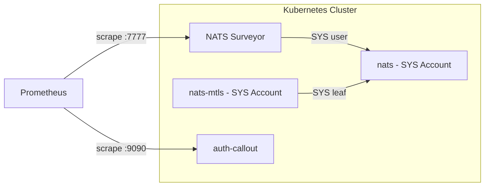

# DSX Event Bus - Deployment

This directory contains the `nats-event-bus` **umbrella Helm chart**. It bundles
the NATS server, NACK controller, Surveyor, and the auth-callout service chart
(from `auth-callout/deploy/`) as subcharts. The umbrella chart is the standard
deployment unit — install it once per Kubernetes cluster.

Each subchart can also be developed and tested independently. The auth-callout
service chart (`auth-callout/deploy/`) has its own README and values reference.
When deploying through the umbrella chart, configure subchart values under the
chart alias key (e.g., `auth-callout:` in the umbrella values).

The chart is deployed **independently in each Kubernetes cluster** (one CSC,
multiple CPCs). The deployments connect via leaf node federation, providing a
unified CSC topic space across all clusters and independent CPC topic spaces
with controlled cross-layer routing.

For architecture details (topology, topic spaces, federation), see [docs/architecture.md](../docs/architecture.md).

## Prerequisites

- **Kubernetes**: 1.27+
- **Helm**: 4.0+
- Envoy Gateway operator (GatewayClass `eg`)
- MetalLB or cloud LoadBalancer
- cert-manager (for mTLS certificates)
- Prometheus Operator (for ServiceMonitor CRDs used by Surveyor and auth-callout)
- Persistent storage (for JetStream file storage, if enabled)
- Keycloak or OIDC provider (if using OAuth2)
- Local access to this repository for the bundled `auth-callout` chart

### Resource Requirements

| Component | Replicas | CPU Request | Memory Request | CPU Limit | Memory Limit |
|-----------|----------|-------------|----------------|-----------|--------------|
| nats | 3 | 200m | 512Mi | 1000m | 2Gi |
| nats-mtls | 1 | 100m | 256Mi | 500m | 1Gi |
| auth-callout | 1 | 10m | 32Mi | 100m | 128Mi |
| nack | 1 | 10m | 32Mi | 100m | 128Mi |
| surveyor | 1 | 10m | 32Mi | 100m | 128Mi |

### Install Order

1. Infrastructure (Envoy Gateway, MetalLB, cert-manager)
2. Keycloak (if using OAuth2)
3. CSC cluster
4. CPC clusters (connect to CSC via leaf nodes)

### Required Secrets

Secret name and key are overridable, these are the defaults.

**NATS Server Auth:**

| Secret | Keys | Purpose |
|--------|------|---------|
| `nats-auth-signing` | pubkey | AUTH account signing key |
| `nats-xkey` | pubkey | Encryption XKey |

**Auth-Callout Service:**

| Secret | Keys | Purpose |
|--------|------|---------|
| `nats-authx-user` | pubkey | Auth-callout NATS connection user |
| `auth-callout-keys` | nkey-seed, issuer-seed, xkey-seed | Auth-callout signing and encryption keys |

**NACK Controller:**

| Secret | Keys | Purpose |
|--------|------|---------|
| `nats-nack-user` | nack-user.nk | NACK NKey file (used by nack subchart) |
|                  | pubkey | NACK user pubkey (for auth-callout permissions) |

**mTLS Server** (only when `global.eventBus.mtls.enabled: true`)**:**

| Secret | Keys | Purpose |
|--------|------|---------|
| `nats-mtls-server-tls` | ca.crt, tls.crt, tls.key | mTLS server certificates |

**mTLS Leaf Connections** (only when `global.eventBus.mtls.enabled: true`)**:**

| Secret | Keys | Purpose |
|--------|------|---------|
| `nats-mtls-leaf` | seed, pubkey | DC account leaf connection |
| `nats-mtls-authx-leaf` | seed, pubkey | AUTHX account leaf connection |
| `nats-mtls-sys-leaf` | seed, pubkey | SYS account leaf connection (monitoring) |

**Surveyor (monitoring):**

| Secret | Keys | Purpose |
|--------|------|---------|
| `nats-surveyor` | seed, pubkey | Surveyor NKey for SYS account access |

**Cross-Cluster Leaf Connections:**

Each CPC gets a `nats-leaf-csc` secret. The CSC gets a matching
`nats-leaf-cpc-{id}` secret for each CPC; the chart uses the pubkey from those
CSC-side secrets to authorize incoming CPC leaf connections.

| Secret | Keys | Purpose |
|--------|------|---------|
| `nats-leaf-csc` | seed | CPC to CSC leaf (CPC only) |
| `nats-leaf-cpc-{id}` | pubkey | CPC leaf user (CSC only, via generated auth-callout env) |
| `nats-leaf-{account}-csc` | seed | Extra-account CPC to CSC leaf (CPC only) |
| `nats-leaf-{account}-cpc-{id}` | pubkey | Extra-account CPC leaf user (CSC only, via generated auth-callout env) |

Generated NKey environment references use the standard secret names above by
default. Override a generated reference with
`global.eventBus.nkeySecretRefOverrides`, keyed by the default secret name and
key:

```yaml
global:
  eventBus:
    nkeySecretRefOverrides:
      nats-leaf-launchlayer-cpc-1:
        pubkey:
          valueFrom:
            secretKeyRef:
              name: custom-launchlayer-leaf
              key: cpc-1-pubkey
```

The NACK and Surveyor subcharts mount their own NKey credential files through
their native values (`nack.jetstream.nats.nkey.secret` and
`surveyor.config.nkey.secret`). If those credential secret names change, update
the subchart value and the matching auth-callout pubkey override.

### Generating Secrets

An example script is provided to generate all required secrets to local files:

```bash
# Generate CSC only
./scripts/generate-nkeys.sh [OPTIONS]

# Generate CSC plus requested CPC clusters
./scripts/generate-nkeys.sh [OPTIONS] [cpc-ids...]

# Options:
#   -o, --output DIR         Output root directory (default: deploy/secrets)
#       --extra-account NAME Generate CPC-to-CSC leaf keys for an extra account
#   -h, --help               Show help message

# Examples:
./scripts/generate-nkeys.sh                    # Generate CSC only
./scripts/generate-nkeys.sh 1 2 3              # Generate CSC, CPC-1, CPC-2, CPC-3
./scripts/generate-nkeys.sh --extra-account LaunchLayer 1 2
./scripts/generate-nkeys.sh -o ./my-secrets 4  # Generate CSC and CPC-4 under ./my-secrets
```

The script requires `nsc` and `nk` on `PATH`.

The script is additive. Existing cluster outputs are left unchanged except for
unused leaf credential keys from older layouts. For each requested CPC, the
CPC-to-CSC leaf seed is stored in that CPC as `nats-leaf-csc`; CSC stores only
the matching public key as `nats-leaf-cpc-{id}`. For each extra account, the
same split is used with `nats-leaf-{account}-csc` on the CPC and
`nats-leaf-{account}-cpc-{id}` on CSC.

Generated secret files are written with mode `0600`, and generated secret
directories are written with mode `0700`. Treat the full output directory as
sensitive material.

Output structure:
```
deploy/secrets/
├── csc/
│   └── nkeys/
│       ├── nats-auth-signing/{seed,pubkey}
│       ├── nats-xkey/{seed,pubkey}
│       ├── nats-authx-user/{seed,pubkey}
│       ├── nats-nack-user/{seed,pubkey,nack-user.nk}
│       ├── nats-mtls-leaf/{seed,pubkey}
│       ├── nats-mtls-authx-leaf/{seed,pubkey}
│       ├── nats-mtls-sys-leaf/{seed,pubkey}
│       ├── nats-surveyor/{seed,pubkey}
│       ├── auth-callout-keys/{nkey-seed,issuer-seed,xkey-seed}
│       ├── nats-leaf-cpc-{id}/pubkey
│       └── nats-leaf-{account}-cpc-{id}/pubkey
└── cpc-{id}/
    └── nkeys/
        ├── nats-auth-signing/{seed,pubkey}
        ├── nats-xkey/{seed,pubkey}
        ├── nats-authx-user/{seed,pubkey}
        ├── nats-nack-user/{seed,pubkey,nack-user.nk}
        ├── nats-mtls-leaf/{seed,pubkey}
        ├── nats-mtls-authx-leaf/{seed,pubkey}
        ├── nats-mtls-sys-leaf/{seed,pubkey}
        ├── nats-surveyor/{seed,pubkey}
        ├── auth-callout-keys/{nkey-seed,issuer-seed,xkey-seed}
        ├── nats-leaf-csc/seed
        └── nats-leaf-{account}-csc/seed
```

## Chart Dependencies

This umbrella chart bundles the following subcharts:

| Chart | Alias | Documentation |
|-------|-------|---------------|
| nats | `nats` | [nats-io/k8s](https://github.com/nats-io/k8s/tree/main/helm/charts/nats) |
| nats | `nats-mtls` | [nats-io/k8s](https://github.com/nats-io/k8s/tree/main/helm/charts/nats) (condition: `global.eventBus.mtls.enabled`) |
| nack | `nack` | [nats-io/nack](https://github.com/nats-io/nack) |
| auth-callout | `auth-callout` | [auth-callout/deploy](../auth-callout/deploy/README.md) |
| surveyor | `surveyor` | [nats-io/nats-surveyor](https://github.com/nats-io/nats-surveyor) |

## Installation

```bash
# Update dependencies
helm dependency update ./nats-event-bus

# Install (dry-run first)
helm install dsx ./nats-event-bus -n dsx --create-namespace --dry-run

# Install
helm install dsx ./nats-event-bus -n dsx --create-namespace

# With custom values
helm install dsx ./nats-event-bus -n dsx --create-namespace -f values-csc.yaml
```

## Umbrella Chart Configuration

These values live under `global.eventBus` so the umbrella chart and subcharts share one event bus configuration.

### Gateway Routes

Configure TCPRoute/TLSRoute resources for Envoy Gateway:

```yaml
global:
  eventBus:
    gateway:
      routes:
        mqtt:
          enabled: true
          kind: TCPRoute              # TCPRoute or TLSRoute
          gatewayName: shared-gateway
          gatewayNamespace: envoy-gateway-system
          sectionName: mqtt
        natsClient:
          enabled: true
          kind: TCPRoute
          gatewayName: shared-gateway
          gatewayNamespace: envoy-gateway-system
          sectionName: nats-client
        natsLeafnode:
          enabled: true
          kind: TCPRoute
          gatewayName: shared-gateway
          gatewayNamespace: envoy-gateway-system
          sectionName: nats-leafnode
        mqttMtls:
          enabled: true
          kind: TLSRoute
          gatewayName: shared-gateway
          gatewayNamespace: envoy-gateway-system
          sectionName: mqtt-mtls
```

### MQTT Streams

Configure JetStream streams for MQTT persistence (managed by NACK):

```yaml
global:
  eventBus:
    mqttStreams:
      maxBytes: 67108864  # 64MB per stream
      replicas: 3         # stream replicas (match NATS cluster size)
      storage: memory     # memory or file
```

## Event Bus Configuration

The `global.eventBus` section provides a high-level API for configuring the event bus. Internal NATS details (accounts, mappings, leaf nodes) are auto-generated based on `clusterType`.

### Cluster Type

Set `global.eventBus.clusterType` to configure the cluster:

```yaml
global:
  eventBus:
    clusterType: cpc        # "csc" or "cpc"
    clusterId: "1"          # Required for CPC clusters
    cscEndpoint: "nats://csc-gateway:7422"  # Required for CPC clusters
    cpcIds: ["1", "2"]      # CSC only: which CPCs will connect as leaves
```

| Field | Default | Purpose |
|-------|---------|---------|
| `clusterType` | `csc` | "csc" or "cpc" - auto-configures accounts, leaf nodes, JetStream domains |
| `clusterId` | `null` | CPC only: unique identifier for this CPC (used in prefixes) |
| `cscEndpoint` | `null` | CPC only: CSC's external NATS leaf node endpoint |
| `cpcIds` | `null` | CSC only: list of CPC IDs that will connect as leaves |

### Cross-Layer Subject Routing

Cross-layer configuration controls which topics are copied between the CPC local topic space and the CSC unified topic space.

#### Routing Behavior

- Topics in `cpcExports` are copied from CPC topic space to CSC topic space with a `cpc.{id}.` prefix added
- Topics in `cscExports` are copied from CSC topic space to all CPC topic spaces (no prefix change)
- Topics in `cscPrefixedExports` matching `cpc.{id}.` are copied to that specific CPC topic space with the prefix stripped

#### Configuration

```yaml
global:
  eventBus:
    crossLayer:
      cscExports: ["events.>"]          # subjects exported from CSC
      cscPrefixedExports: ["commands"]  # subjects with CPC prefix
      cpcExports: ["telemetry.>"]       # subjects exported from CPC
```

| Field | Purpose |
|-------|---------|
| `cscExports` | Subjects broadcast from CSC to all CPC topic spaces |
| `cscPrefixedExports` | Subjects targeted to specific CPC (prefix stripped on delivery) |
| `cpcExports` | Subjects exported from this CPC to CSC (prefix added) |

This generates NATS account import/export rules in `nats-accounts-config.yaml`.

### Extra Accounts

Add cluster-wide NATS accounts with automatic configuration:

```yaml
global:
  eventBus:
    extraAccounts:
      LaunchLayer:
        jetstream: true
      Kiwi: {}  # Minimal account with defaults
```

Extra account names must use letters and numbers only, start with a letter, and
must not use built-in account names (`SYS`, `AUTH`, `AUTHX`, `CSC`, `CPC`) or
start with `cpc` in any case.
Extra account properties are passed through on CSC clusters except `enabled`.
CSC owns extra-account JetStream. CPC clusters render the account as a
CPC-to-CSC leaf proxy: plain `$JS.API.>` requests are mapped to the CSC
JetStream domain and sent over the account leaf connection. The chart generates
`secretKeyRef` env vars for `LEAF_{ACCOUNT}_USER_SEED` on CPC clusters and
`NKEY_LEAF_{ACCOUNT}_CPC_{id}_PUBKEY` on CSC clusters. Missing secrets fail pod
startup because the generated refs are not optional.

The chart generates `global.eventBus.auth.permissions.nkey` entries named
`leaf-cpc-{id}` and `leaf-{account}-cpc-{id}` for leaf authorization. Do not
define manual NKey permission entries with those names.

### mTLS MQTT Endpoint

The chart can deploy a separate NATS instance (`nats-mtls`) that accepts MQTT connections authenticated with client certificates (mTLS). This instance has no JetStream of its own; it connects to the main NATS cluster via leaf nodes and forwards auth requests through the shared auth-callout service.

```yaml
global:
  eventBus:
    mtls:
      enabled: true  # default
```

Set `global.eventBus.mtls.enabled: false` to disable the mTLS NATS cluster. When disabled:

- The `nats-mtls` subchart is not rendered (no pods, services, or config)
- The `mqttMtls` gateway route is not created
- The `nats-mtls-accounts-config` ConfigMap is not created
- mTLS-specific keys are omitted from `nats-env-config`
- mTLS leaf nkey entries are omitted from the auth-callout permissions
- The mTLS secrets (`nats-mtls-server-tls`, `nats-mtls-leaf`, `nats-mtls-authx-leaf`, `nats-mtls-sys-leaf`) are not required

## Subchart Configuration

Configure subcharts by prefixing values with the chart alias.

### NATS (`nats.*` and `nats-mtls.*`)

```yaml
nats:
  config:
    cluster:
      replicas: 3
    jetstream:
      enabled: true
    mqtt:
      enabled: true
```

See [NATS Helm chart documentation](https://github.com/nats-io/k8s/tree/main/helm/charts/nats). For required environment variables, see [Environment Variables](#environment-variables).

### Auth Callout (`auth-callout.*`)

A single auth callout service handles authentication for both the main NATS cluster and mTLS NATS cluster. The mTLS NATS cluster forwards authentication requests to the main NATS cluster via a leaf node connection.

```yaml
auth-callout:
  serviceConfig:
    nats:
      url: "nats://nats:4222"
    jwks:
      url: "https://keycloak.example.com/realms/event-bus/protocol/openid-connect/certs"
      issuer: "https://keycloak.example.com/realms/event-bus"
```

Auth permissions are configured via `global.eventBus.auth.permissions`, not under `auth-callout`. See [auth-callout Helm chart documentation](../auth-callout/deploy/README.md).

### NACK (`nack.*`)

```yaml
nack:
  jetstream:
    enabled: true
    nats:
      url: "nats://nats:4222"
```

See [NACK documentation](https://github.com/nats-io/nack).

## Environment Variables

The NATS config uses `<< $VAR >>` placeholders resolved at container runtime. The umbrella chart pre-configures these environment variables to pull values from Kubernetes secrets (see [Required Secrets](#required-secrets)). Operators generally do not need to override these unless using a non-standard secret structure.

## Recommended Setup

For production deployment with Vault, cert-manager, and Gateway configuration,
see [docs/pre-deployment.md](../docs/pre-deployment.md) and
[docs/getting-started.md](../docs/getting-started.md).

## Exposed Ports

External access via Envoy Gateway TCPRoutes/TLSRoutes:

| Port | Protocol | Service | Description |
|------|----------|---------|-------------|
| 1883 | MQTT | nats | Standard MQTT 3.1.1 (TLS terminated at Envoy) |
| 4222 | NATS | nats | NATS client connections |
| 7422 | NATS | nats | Leaf node connections (cross-cluster federation) |
| 8883 | MQTT | nats-mtls | mTLS MQTT 3.1.1 (TLS passthrough to NATS pod) |

### Internal Services

| Service | Port | Description |
|---------|------|-------------|
| `nats:4222` | 4222 | Main NATS clients |
| `nats:7422` | 7422 | Leaf nodes |
| `nats:1883` | 1883 | MQTT 3.1.1 |
| `nats-mtls:4222` | 4222 | mTLS NATS clients |
| `nats-mtls:1883` | 1883 | mTLS MQTT 3.1.1 |
| `surveyor:7777` | 7777 | Prometheus metrics |

## Monitoring

NATS Surveyor exports Prometheus metrics from the NATS cluster. Auth-callout exposes authentication metrics on its Prometheus endpoint. The mTLS cluster's SYS account is federated to the main cluster via leaf node, enabling centralized monitoring of both clusters.

**Prerequisite:** Prometheus Operator must be installed for the ServiceMonitor CRD. Install via `kube-prometheus-stack` Helm chart or equivalent.

### Surveyor Configuration

Surveyor is configured via the `surveyor` section in values:

```yaml
surveyor:
  config:
    servers: "nats://nats:4222"   # NATS connection URL
    expectedServers: 3            # Expected cluster size
    accounts: true                # Enable account metrics
    jsz: all                      # JetStream metrics (streams, consumers)
    nkey:                         # NKey authentication to SYS account
      secret:
        name: nats-surveyor
        key: seed
  serviceMonitor:
    enabled: true                 # Create ServiceMonitor for Prometheus
    interval: 30s
```

Auth-callout metrics are exposed on port 9090 at `/metrics`. The parent chart enables the auth-callout ServiceMonitor by default:

```yaml
auth-callout:
  serviceMonitor:
    enabled: true
    interval: 30s
    path: /metrics
```

### Metrics

Surveyor exposes metrics on port 7777 at `/metrics`. Key metric families:

- `nats_core_*` - Core server metrics (connections, messages, bytes)
- `nats_account_*` - Per-account metrics
- `nats_jetstream_*` - JetStream stream/consumer metrics

See [NATS Surveyor documentation](https://github.com/nats-io/nats-surveyor) for the complete metrics reference.

### Monitoring Architecture



## Validation

```bash
# Check all pods are running
kubectl get pods -n dsx

# Test MQTT connectivity
mqttx pub -h $GATEWAY_IP -p 1883 -t test/topic -m "hello" \
  -u "oauthtoken" -P "$ACCESS_TOKEN" -V 3.1.1

# Or test NATS connectivity
nats pub test.topic "hello" --server nats://$GATEWAY_IP:4222
```

## Example Deployment

This example deployment uses layered values files: common values shared across clusters, cluster-type values (CSC or CPC), and cluster-specific overrides.

### Common Values (all clusters)

```yaml
# local-dev-values.yaml - shared across all clusters
auth-callout:
  serviceConfig:
    jwks:
      url: "https://keycloak.example.com/realms/event-bus/protocol/openid-connect/certs"
      issuer: "https://keycloak.example.com/realms/event-bus"
    mtls:
      ca-path: "/etc/mtls-ca/ca.crt"
```

### CSC Cluster

```yaml
# csc/values.yaml
global:
  eventBus:
    clusterType: csc
    cpcIds: ["1", "2"]
    auth:
      permissions:
        oauth2:
          mqtt-client:
            azp: "mqtt-client"
            account: "CSC"
            permissions:
              pub:
                allow: ["events.>"]
              sub:
                allow: ["events.>"]
        mtls:
          mqtt-client:
            identity: "CN=mqtt-client.csc"
            account: "CSC"
        noauth:
          account: "CSC"
```

The chart generates `NKEY_LEAF_CPC_{N}_PUBKEY` env refs for every
`global.eventBus.cpcIds` entry on CSC clusters.

### CPC Cluster

```yaml
# cpc/values.yaml
global:
  eventBus:
    clusterType: cpc
    clusterId: "1"
    cscEndpoint: "nats://csc.example.com:7422"
    crossLayer:
      cscExports: ["broadcast.>"]
      cscPrefixedExports: ["command.>"]
      cpcExports: ["sensor.>"]
    auth:
      permissions:
        oauth2:
          mqtt-client:
            azp: "mqtt-client"
            account: "CPC"
            permissions:
              pub:
                allow: ["events.>"]
              sub:
                allow: ["events.>"]
        mtls:
          mqtt-client:
            identity: "CN=mqtt-client.cpc-1"
            account: "CPC"
        noauth:
          account: "CPC"
```
