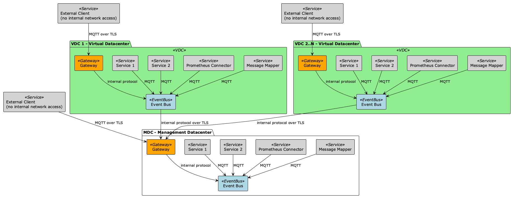
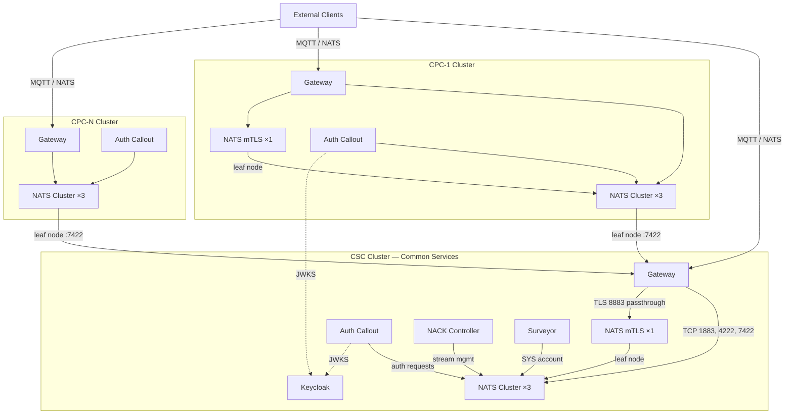

# Architecture

## DSX Exchange

DSX Exchange is an open source event bus for AI factory operations. It supports real-time operational signal exchange between power management systems, building management systems, cooling infrastructure, grid interfaces, and compute schedulers.

DSX Exchange consists of three components:

| Component | What It Is |
|-----------|------------|
| DSX Event Bus | NATS with MQTT 3.1.1, HA clustering, and leaf-node federation |
| AsyncAPI Schema | Formal topic definitions and payload contracts per service team |
| Auth-Callout Service | OAuth2/mTLS/NKey authentication with topic-level ACLs |

## DSX Event Bus

The DSX Event Bus is a [NATS](https://nats.io/) messaging platform that provides MQTT 3.1.1 connectivity, [JetStream](https://docs.nats.io/nats-concepts/jetstream) persistence, and multi-cluster [leaf node federation](https://docs.nats.io/running-a-nats-service/configuration/leafnodes) across the AI factory topology.

The event bus supports the following capabilities:

- **High availability.** 3-node cluster with topology-aware anti-affinity and automatic failover.
- **Persistent messaging.** JetStream-backed QoS 0/1 and retained message support with in-memory replication.
- **Multi-cluster federation.** Leaf node connections between deployment layers with controlled topic filtering at each boundary.
- **Declarative deployment.** Helm chart-based, ArgoCD-compatible, with no manual intervention required.

### Why MQTT 3.1.1

DSX Exchange targets MQTT 3.1.1 rather than MQTT 5 because a major integration surface is building management systems and industrial OT infrastructure. The BMS and process-control industry overwhelmingly ships MQTT 3.1.1 clients, and the 3.1.1 protocol is simpler with fewer edge cases. This is a deliberate architectural decision — NATS implements MQTT 3.1.1 only, and 3.1.1 maximizes compatibility with the installed base of OT and BMS devices in a gigawatt-scale AI factory.

Concrete signal paths it enables today:

- **BMS -> DPS**: real-time power telemetry so DPS can close the MaxLPS dynamic power allocation loop (recovering up to 40% stranded capacity)
- **BMS -> NICo**: coolant leak events so NICo can cordon nodes and migrate workloads in seconds, not minutes
- **Grid -> DSX Flex -> Scheduler**: demand-response curtailment signals so the factory can shed load within seconds
- **GPU telemetry -> thermal optimization agents**: real-time thermal data so predictive agents can pre-adjust cooling setpoints before temperature spikes

## System Overview

PlantUML sources are in `assets/diagrams/`.

## Cluster Topology

The AI Factory deploys one Common Services Cluster (CSC) and one or more Control Plane Clusters (CPCs). Each cluster runs an independent NATS event bus instance. CPCs federate to the CSC via NATS leaf node connections through a Kubernetes Gateway API-compatible controller.

Each cluster is a separate Kubernetes cluster with overlapping internal networks. All inter-cluster communication flows through Gateway LoadBalancer services with unique external IPs. The cluster operator provides the Gateway API implementation (Envoy Gateway is used in the reference deployment but any conformant controller works).

### Components Per Cluster (defaults)

Replica counts are defaults for a reference deployment. Actual values are configurable and depend on the scale of the data center deployment.

| Component | Default Replicas | Purpose |
|-----------|-----------------|---------|
| NATS (main) | 3 | MQTT/NATS clients, JetStream persistence |
| NATS (mTLS) | 1 | mTLS-authenticated MQTT endpoint, optional |
| Auth Callout | 1 | Authenticates connections for both NATS instances |
| NACK | 1 | JetStream controller for declarative stream management |
| Surveyor | 1 | Prometheus metrics exporter |

## Topic Spaces

The event bus provides two types of topic space:

**CSC Topic Space** is a unified namespace that spans all clusters. Messages published here are visible to subscribers in every cluster. Clients see full topic paths including CPC prefixes (e.g., `cpc.1.telemetry.temp`).

**CPC Topic Spaces** are per-cluster local namespaces. Messages stay within that CPC unless the topic is configured for cross-layer routing. Clients use simple names without prefixes (e.g., `telemetry/temp`).

### Cross-Layer Routing

Detailed routing diagrams for every publish scenario (local, cross-space, federated) are in `assets/diagrams/routing/`.

Cross-layer configuration controls which topics are copied between CPC local and CSC unified topic spaces:

| Direction | Config Key | Behavior |
|-----------|-----------|----------|
| CPC -> CSC | `cpcExports` | Copied with `cpc.{id}.` prefix added |
| CSC -> all CPCs | `cscExports` | Broadcast to all CPC topic spaces |
| CSC -> specific CPC | `cscPrefixedExports` | `cpc.{id}.` prefix stripped on delivery |

Routing is enforced by NATS account import/export rules generated from `global.eventBus.crossLayer` Helm values. The Gateway controller does no topic filtering — it passes TCP traffic transparently.

**The three lists must not overlap.** A subject pattern that appears in more than one list creates cyclic NATS imports that crash the NATS pod (CrashLoopBackOff) with no user-facing error at install time.

## MQTT Support

NATS provides native MQTT 3.1.1 support. MQTT topic separators (`/`) are mapped to NATS subject tokens (`.`) — for example, the MQTT topic `telemetry/temp` becomes the NATS subject `telemetry.temp`. This mapping is transparent to MQTT clients.

Supported QoS levels:

- **QoS 0** — at most once (fire and forget)
- **QoS 1** — at least once (acknowledged delivery, backed by JetStream)
- **QoS 2** — exactly once (backed by JetStream)

## Networking

### Exposed Ports

| Port | Protocol | Service | Description |
|------|----------|---------|-------------|
| 1883 | MQTT | nats | Standard MQTT 3.1.1 (TLS terminated at Envoy) |
| 4222 | NATS | nats | NATS client connections |
| 7422 | NATS | nats | Leaf node connections (cross-cluster federation) |
| 8883 | MQTT | nats-mtls | mTLS MQTT 3.1.1 (TCP passthrough, TLS at NATS pod) |

### Layer Isolation

- **Network isolation**: separate Kubernetes clusters with overlapping internal subnets
- **Gateway enforcement**: inter-cluster traffic flows only through Gateway API LoadBalancers
- **Topic filtering**: NATS account configuration enforces which subjects cross layer boundaries

## Persistence

JetStream provides message persistence. MQTT QoS 1 messages and retained messages are stored in JetStream streams managed declaratively by the NACK controller.

- The built-in CPC account uses local JetStream for its own topic space and domain mapping to the CSC for cross-layer persistence; extra accounts keep their own account configuration on each cluster and are bridged by leaf nodes.
- Stream configuration (storage type, replicas, max bytes) is set via `mqttStreams` Helm values

## Observability

| Signal | Tool | Endpoint |
|--------|------|----------|
| Metrics (NATS) | Surveyor | `:7777/metrics` (Prometheus) |
| Metrics (auth-callout) | Prometheus client | `:9090/metrics` |
| Tracing | OpenTelemetry -> Tempo | OTLP gRPC `:4317` |
| Dashboards | Grafana | Prometheus + Tempo data sources |

The mTLS cluster's SYS account is federated to the main cluster via leaf node, enabling centralized monitoring of both NATS instances from a single Surveyor.
